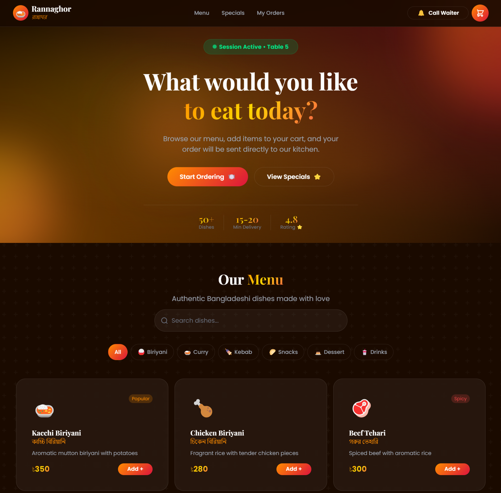

# Modern Restaurant Ordering System



A next-generation dining experience featuring **QR Code Table Detection**, **Real-time Status Tracking**, and a stunning **Glassmorphism UI**. Designed to streamline the ordering process with style and efficiency.

🔗 **Live Demo:** [https://tamimtxd.github.io/restaurant-ordering-system/](https://tamimtxd.github.io/restaurant-ordering-system/)

## ✨ Features

-   **Dynamic Menu**: Browse categories like Biriyani, Curry, Kebab, Snacks, and Desserts.
-   **Interactive Cart**: Add items, adjust quantities, and view real-time totals (including VAT).
-   **Order Tracking**: Visual status tracker simulating the kitchen process (Received → Preparing → Ready → Served).
-   **Table Management**: Simulated QR code table selection flow.
-   **Responsive Design**: Fully optimized for mobile, tablet, and desktop devices.
-   **Modern UI/UX**: Glassmorphism effects, smooth animations, and a premium dark aesthetic.

## 🛠️ Technologies Used

-   **HTML5**: Semantic structure.
-   **CSS3**: Custom styles with animations and Tailwind CSS (via CDN) for utility classes.
-   **JavaScript (ES6+)**: DOM manipulation, state management, and interaction logic.
-   **LocalStorage**: Persists cart and order data locally in the browser.

## 📂 Project Structure

```
rannaghor-website/
├── index.html      # Main application structure
├── style.css       # Custom CSS for animations and theming
├── script.js       # Application logic (Menu, Cart, Orders)
└── README.md       # Project documentation
```

## 🚀 Getting Started

To run this project locally:

1.  **Clone the repository**:
    ```bash
    git clone https://github.com/tamimtxd/restaurant-ordering-system.git
    ```
2.  **Open `index.html`**:
    Simply open the `index.html` file in your preferred web browser. No server setup is required for the frontend-only version.

## 🔮 Future Roadmap

-   [ ] **Backend Integration**: Connect to a Node.js/Express backend.
-   [ ] **Database**: Implement MongoDB to store menu items and orders permanently.
-   [ ] **Admin Dashboard**: Create an interface for kitchen staff to manage orders.
-   [ ] **Payment Gateway**: Integrate online payment options.

## 📄 License

This project is open source and available under the [MIT License](LICENSE).

---

Made with ❤️ in Bangladesh
