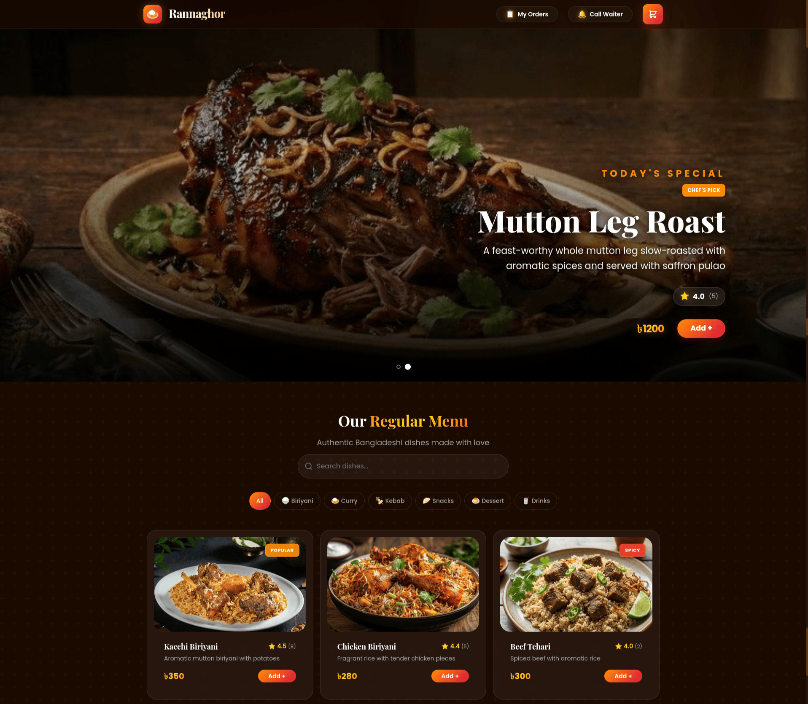

# Modern Restaurant Ordering System

<p align="center">
  
</p>

A next-generation dining experience featuring **QR Code Table Detection**, **Real-time Status Tracking**, and a stunning **Glassmorphism UI**. Designed to streamline the ordering process with style and efficiency.

🔗 **Live Demo:** [https://tamimtxd.github.io/restaurant-ordering-system/](https://tamimtxd.github.io/restaurant-ordering-system/)

## ✨ Features

-   **Real-time Kitchen Dashboard**: A dedicated interface for staff to manage orders as they arrive, featuring instant synchronization and mobile-optimized search.
-   **Premium Desktop Experience**: A sophisticated two-column landscape modal for item details and customer reviews, designed for high-end desktop displays.
-   **Dynamic Menu**: Browse categories like Biriyani, Curry, Kebab, Snacks, and Desserts with cinematic slider backgrounds.
-   **Interactive Cart**: Add items, adjust quantities, and view real-time totals with automatic tax calculation.
-   **Order Tracking**: Visual status tracker synchronized across devices via Supabase.
-   **Table Management**: Automated QR code table selection flow with persistent session tracking.
-   **Ultra-Responsive Layout**: Fully optimized for everything from compact mobile screens to large desktop monitors.

## 🛠️ Technologies Used

-   **HTML5 & CSS3**: Modern structural semantic and advanced glassmorphism theming.
-   **JavaScript (ES6+)**: High-performance DOM manipulation and state management.
-   **Supabase**: Real-time PostgreSQL database for instant order synchronization across multiple devices.
-   **LocalStorage**: Secondary persistence for user preferences and offline cart recovery.

## 📂 Project Structure

```
rannaghor-website/
├── index.html          # Main customer application
├── kitchen.html        # Real-time kitchen staff dashboard
├── qr-codes.html       # QR code table selection interface
├── css/
│   ├── style.css       # Global styles and primary UI components
│   └── kitchen.css     # Specialized dashboard design system
├── js/
│   ├── script.js       # Core customer logic and cart management
│   ├── kitchen.js      # Dashboard real-time synchronization logic
│   └── supabase-config.js # Database connection and real-time settings
├── assets/             # Food photography and brand assets
└── README.md           # Project documentation
```

## 🚀 Getting Started

To run this project locally:

1.  **Clone the repository**:
    ```bash
    git clone https://github.com/tamimtxd/restaurant-ordering-system.git
    ```
2.  **Open `index.html`**: Simply open the file in your browser. 
3.  **Real-time Support**: Ensure your Supabase credentials in `js/supabase-config.js` are active for cross-device sync.

## 🔮 Future Roadmap

-   [x] **Backend Integration**: Connected to Supabase real-time infrastructure.
-   [x] **Database**: Reliable PostgreSQL storage for persistence.
-   [x] **Kitchen Dashboard**: Dedicated professional interface for staff.
-   [ ] **Admin Panel**: Advanced menu management and analytics.
-   [ ] **Payment Gateway**: Integration of online payment processing.

## 📄 License

This project is open source and available under the [MIT License](LICENSE).

---

Made with ❤️ in Bangladesh
